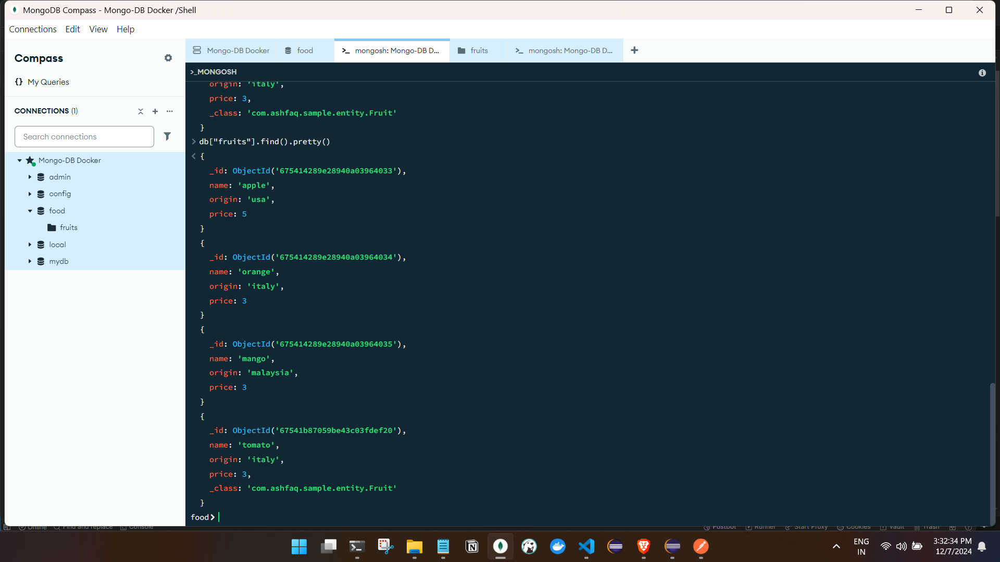

## postman 

- POST :


- verifying from db.


- other data was  inserted into the database directly so there is no class field.

- GET :


- PUT :


- DELETE :





we can perform custom queries, manage relationships, and implement pagination in MongoDB when using Spring Boot. 

## Custom Queries

### 1. Using Repository Methods

Spring Data MongoDB allows we to define custom query methods directly in your repository interface. For example, if we want to find fruits by their name and price:

```java
public interface FruitRepository extends MongoRepository<Fruit, String> {
    List<Fruit> findByNameAndPrice(String name, double price);
}
```

### 2. Using the @Query Annotation

we can also use the `@Query` annotation to define complex queries. For instance, to find fruits with a price greater than a certain value:

```java
@Query("{ 'price' : { $gt: ?0 } }")
List<Fruit> findFruitsWithPriceGreaterThan(double price);
```

### 3. Criteria Queries with MongoTemplate

For more complex queries, we can use `MongoTemplate` with criteria queries:

```java
@Autowired
private MongoTemplate mongoTemplate;

public List<Fruit> findFruitsByCriteria(double minPrice) {
    Query query = new Query();
    query.addCriteria(Criteria.where("price").gt(minPrice));
    return mongoTemplate.find(query, Fruit.class);
}
```

## One-to-One Relationships

In MongoDB, we can handle one-to-one relationships by embedding documents or using references. Here’s an example of how to model a one-to-one relationship:

### Example Model Classes

```java
@Document(collection = "fruits")
public class Fruit {
    @Id
    private String id;
    private String name;
    private String origin;
    private double price;
    
    // Assume there's a NutritionalInfo class for one-to-one relationship
    private NutritionalInfo nutritionalInfo;

    // Getters and Setters
}

@Document(collection = "nutritional_info")
public class NutritionalInfo {
    @Id
    private String id;
    private double calories;
    private double protein;

    // Getters and Setters
}
```

In this case, the `NutritionalInfo` class is embedded within the `Fruit` class.

## Pagination

Spring Data MongoDB supports pagination through the `PagingAndSortingRepository` interface. we can implement pagination like this:

### Example Repository Interface

```java
public interface FruitRepository extends PagingAndSortingRepository<Fruit, String> {
}
```

### Example Service Method for Pagination

```java
public Page<Fruit> getFruitsPaginated(int page, int size) {
    Pageable pageable = PageRequest.of(page, size);
    return fruitRepository.findAll(pageable);
}
```

## Summary of Features

| Feature                    | Description                                                                                  |
|----------------------------|----------------------------------------------------------------------------------------------|
| **Custom Queries**         | Use method naming conventions or `@Query` annotation for custom queries.                   |
| **Complex Queries**        | Utilize `MongoTemplate` for building criteria-based queries.                                |
| **One-to-One Relationships** | Model relationships by embedding documents or using references.                             |
| **Pagination**             | Implement pagination using `PagingAndSortingRepository`.                                     |

By leveraging these capabilities of Spring Data MongoDB, we can effectively manage your data with custom queries, handle relationships, and paginate results just like we would in a traditional relational database system. If we have any specific scenarios or further questions, feel free to ask!

Citations:
[1] https://www.devglan.com/spring-boot/spring-data-mongodb-queries
[2] https://www.youtube.com/watch?v=LAsofxrTFq8
[3] https://docs.spring.io/spring-data/mongodb/reference/mongodb/repositories/query-methods.html
[4] https://stackoverflow.com/questions/48460066/mongorepository-findbythisandthat-custom-query-with-multiple-parameters
[5] https://stackabuse.com/spring-data-mongodb-guide-to-the-query-annotation/
[6] https://docs.spring.io/spring-data/mongodb/reference/repositories/query-methods-details.html